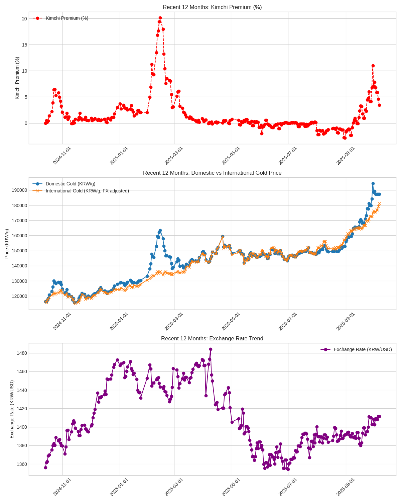

# 김치골드 (Kimchi Gold) 📊



한국 금 시장의 김치 프리미엄을 모니터링하고 분석하는 Python 패키지입니다. 실시간 가격 수집, 데이터 분석, 백테스팅, 시각화 기능을 제공합니다.

## 📋 목차

- [개요](#개요)
- [주요 기능](#주요-기능)
- [설치 및 실행](#설치-및-실행)
- [사용법](#사용법)
- [프로젝트 구조](#프로젝트-구조)
- [백테스팅](#백테스팅)

- [API 참조](#api-참조)

## 🎯 개요

### 김치 프리미엄이란?

김치 프리미엄은 국내 시장에서의 특정 자산(예: 금, 암호화폐) 가격이 해외 시장 가격보다 높게 형성되는 현상을 의미합니다. 이는 주로 국내외 가격 차이와 환율 변동에 의해 발생하며, 투자 심리, 규제 환경 등 다양한 요인이 복합적으로 작용합니다.

**계산식:**
```
김치 프리미엄 (%) = ((국내 금 가격 - 국제 금 가격(환율 조정)) / 국제 금 가격(환율 조정)) * 100
```

여기서 '국제 금 가격(환율 조정)'은 국제 금 가격을 현재 환율을 적용하여 원화로 변환한 값입니다.

## ⭐ 주요 기능

### 1. 실시간 데이터 수집
- 네이버 금융에서 실시간 금 가격 데이터 수집
- 국내 금 가격 (KRX)
- 국제 금 가격 (달러/온스)
- USD/KRW 환율
- 김치 프리미엄 자동 계산

### 2. 데이터 분석
- 김치 프리미엄 이상치 탐지
- 통계적 분석 (사분위수, IQR 기반)
- 과거 데이터 트렌드 분석

### 3. 백테스팅
- 김치 프리미엄 기반 투자 전략 백테스팅
- 사용자 정의 매수/매도 임계값
- 수익률 및 거래 통계 제공
- 최적 임계값 탐색 기능

### 4. 시각화
- 김치 프리미엄 추이 차트
- 국내외 금 가격 비교 차트
- 환율 트렌드 차트
- 최근 6개월/12개월 데이터 시각화

### 5. 자동화
- GitHub Actions 지원
- 일일 데이터 로깅

## 🚀 설치 및 실행

### 요구사항
- Python 3.11+
- uv (Python 패키지 관리자)

### 설치
```bash
# 저장소 클론
git clone <repository-url>
cd kimchi-gold

# 의존성 설치
uv sync
```

### 기본 사용법

#### 1. 현재 금 가격 확인
```bash
uv run check
```

#### 2. 데이터 수집 및 저장
```bash
# 현재 데이터를 CSV 파일에 저장
python -m kimchi_gold.data_collector
```

#### 3. 차트 생성
```bash
# 최근 12개월 차트 생성
python -m kimchi_gold.chart_generator
```

#### 4. 이상치 분석
```bash
# 김치 프리미엄 이상치 분석
python -m kimchi_gold.outlier_analyzer
```

## 💻 사용법

### Python API 사용

```python
from kimchi_gold import (
    fetch_current_gold_market_data,
    collect_and_save_current_gold_market_data,
    perform_kimchi_premium_outlier_analysis,
    create_comprehensive_gold_price_charts
)

# 현재 금 시장 데이터 가져오기
gold_data = fetch_current_gold_market_data()
print(f"김치 프리미엄: {gold_data.kimchi_premium_percent:.2f}%")
print(f"국내 금 가격: {gold_data.domestic_price:,.0f}원/g")

# 데이터 수집 및 저장
success = collect_and_save_current_gold_market_data()
if success:
    print("데이터 수집 완료!")

# 이상치 분석
is_outlier = perform_kimchi_premium_outlier_analysis()
if is_outlier:
    print("⚠️ 김치 프리미엄이 이상치입니다!")

# 차트 생성
create_comprehensive_gold_price_charts()
print("차트가 data/ 폴더에 저장되었습니다.")
```

### 명령줄 도구

#### 현재 가격 확인
```bash
uv run check
```

#### 백테스팅 실행
```bash
# 기본 설정으로 백테스팅
uv run backtest

# 사용자 정의 설정
uv run backtest --start-date 2023-01-01 --buy-threshold -2.0 --sell-threshold 2.0
```

#### 최적 임계값 탐색
```bash
# 기본 범위에서 최적 임계값 탐색
uv run optimal_threshold

# 사용자 정의 범위
uv run optimal_threshold --min-threshold 1.0 --max-threshold 4.0 --step 0.25
```

## 📁 프로젝트 구조

```
kimchi-gold/
├── src/kimchi_gold/           # 메인 패키지
│   ├── __init__.py           # 패키지 초기화 및 API 노출
│   ├── configuration.py      # 설정 및 상수
│   ├── data_models.py        # 데이터 클래스 정의
│   ├── price_fetcher.py      # 가격 데이터 수집
│   ├── data_collector.py     # 데이터 저장 및 관리
│   ├── outlier_analyzer.py   # 이상치 분석
│   ├── chart_generator.py    # 차트 생성
│   ├── backtest.py          # 백테스팅 엔진
│   └── optimal_threshold.py  # 최적 임계값 탐색
├── tests/                    # 테스트 파일
│   ├── test_collect_data.py
│   └── test_now_price.py
├── data/                     # 데이터 저장소
│   ├── kimchi_gold_price_log.csv
│   └── *.png                # 생성된 차트들
├── pyproject.toml           # 프로젝트 설정
├── README.md               # 프로젝트 문서
├── LICENSE                 # 라이선스 (Apache 2.0)
├── FILE_AND_VARIABLE_NAMING_GUIDE.md  # 명명 규칙 가이드
└── REFACTORING_SUMMARY.md  # 리팩토링 요약
```

### 핵심 모듈 설명

#### 1. `data_models.py`
- `GoldPriceData`: 금 가격 데이터를 담는 데이터 클래스
- `ChartGenerationConfiguration`: 차트 생성 설정 클래스

#### 2. `price_fetcher.py`
- 네이버 금융에서 실시간 데이터 수집
- 김치 프리미엄 계산
- HTTP 요청 및 HTML 파싱

#### 3. `data_collector.py`
- CSV 파일로 데이터 저장
- 중복 데이터 방지
- 데이터 무결성 관리

#### 4. `outlier_analyzer.py`
- 통계적 이상치 탐지 (IQR 방법)
- 과거 데이터 기반 분석
- 사분위수 계산

#### 5. `chart_generator.py`
- matplotlib 기반 차트 생성
- 김치 프리미엄, 가격 비교, 환율 차트
- 사용자 정의 기간 설정

#### 6. `backtest.py`
- 김치 프리미엄 기반 투자 전략 백테스팅
- 매수/매도 신호 생성
- 수익률 및 통계 계산

#### 7. `optimal_threshold.py`
- 최적 매수/매도 임계값 탐색
- 그리드 서치 방식
- 수익률 최적화


참고 자료:

* [https://blog.stephenturner.us/p/uv-part-2-building-and-publishing-packages](https://blog.stephenturner.us/p/uv-part-2-building-and-publishing-packages)
* [https://ecos.bok.or.kr/api/#/DevGuide/StatisticalCodeSearch](https://ecos.bok.or.kr/api/#/DevGuide/StatisticalCodeSearch)
* [https://docs.outcode.biz/tutorials/api/gold](https://docs.outcode.biz/tutorials/api/gold)
* [http://data.krx.co.kr/contents/MDC/MDI/mdiLoader/index.cmd?menuId=MDC0201060201](http://data.krx.co.kr/contents/MDC/MDI/mdiLoader/index.cmd?menuId=MDC0201060201)

## 📈 백테스팅

김치 프리미엄을 활용한 투자 전략의 성과를 분석할 수 있습니다.

### 사용법

```bash
# 기본 설정으로 백테스팅 실행
uv run backtest

# 시작 날짜 설정
uv run backtest --start-date 2023-01-01

# 매수/매도 임계값 사용자 정의
uv run backtest --buy-threshold -2.0 --sell-threshold 2.0

# 초기 투자금 설정
uv run backtest --investment 2000000

# 모든 옵션 조합
uv run backtest --start-date 2020-01-01 --buy-threshold -2.5 --sell-threshold 2.5 --investment 1500000

# 도움말 확인
uv run backtest --help
```

### 전략 로직

1. **초기 매수**: 시작일에 괴리율 고려 없이 전액 매수
2. **매수 조건**: 
   - 괴리율 ≤ -3.0% (기본값, 사용자 정의 가능)
   - 현금 보유 중일 때
3. **매도 조건**: 
   - 괴리율 ≥ +3.0% (기본값, 사용자 정의 가능)
   - 금 보유 중일 때
4. **재매수 조건**: 
   - 매도 후 괴리율이 -0.16% ~ +0.16% 범위로 안정화
   - 시장이 정상 상태로 돌아왔을 때 재진입

### 백테스팅 결과 예시

```bash
시작일 매수: 2023-05-09, 가격: 86400.00원/g, 수량: 11.57g, 괴리율: 0.27%
매도: 2024-04-03, 가격: 104769.52원/g, 수량: 11.57g, 현금: 1,210,770원, 손익: 210,770원, 괴리율: 6.08%
재매수: 2024-05-13, 가격: 104348.67원/g, 수량: 11.60g, 괴리율: 0.71%
매도: 2024-10-23, 가격: 129776.90원/g, 수량: 11.60g, 현금: 1,505,816원, 손익: 505,816원, 괴리율: 6.35%

=== 백테스팅 결과 ===
초기 투자금: 1,000,000원
최종 포트폴리오 가치: 1,943,363원
총 수익: 943,363원
수익률: 94.34%
총 거래 횟수: 8회
거래당 평균 수익: 235,841원
```

### 최적 임계값 탐색

```bash
# 기본 범위에서 최적 임계값 탐색 (0.5% ~ 5.0%, 0.5% 단위)
uv run optimal_threshold

# 사용자 정의 범위
uv run optimal_threshold --min-threshold 1.0 --max-threshold 4.0 --step 0.25

# 특정 기간 데이터로 최적화
uv run optimal_threshold --start-date 2023-01-01
```

### 최적화 결과 예시

```bash
=== 최적 임계값 탐색 시작 ===
테스트 범위: 0.5% ~ 5.0% (단계: 0.5%)
총 테스트 횟수: 10회

================================================================================
최적화 결과 (수익률 기준 정렬)
================================================================================
순위 임계값   수익률     총수익       최종가치     거래횟수
--------------------------------------------------------------------------------
1    ±2.5%    127.45%   1,274,500원  2,274,500원    12회
2    ±3.0%     94.34%     943,363원  1,943,363원     8회
3    ±2.0%     89.12%     891,200원  1,891,200원    16회

==================================================
최적 결과 상세
==================================================
최적 임계값: ±2.5%
매수 임계값: -2.5%
매도 임계값: 2.5%
최종 수익률: 127.45%
총 수익: 1,274,500원
최종 포트폴리오 가치: 2,274,500원
총 거래 횟수: 12회
거래당 평균 수익: 212,417원
```